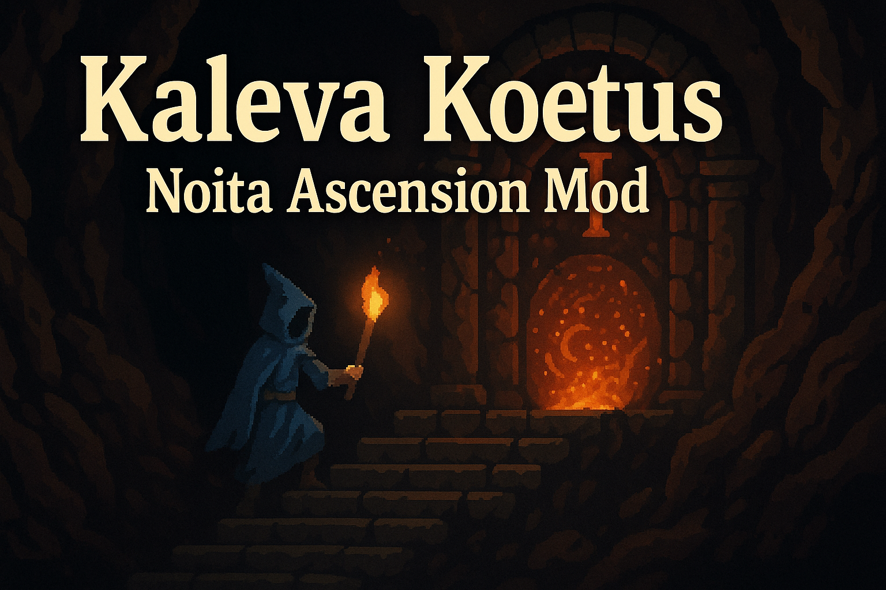

# Kaleva Koetus (Kalevaの試練)

Noita Ascension Mod

## 概要

Kaleva Koetusは、Noitaに段階的な難易度上昇システム（アセンション）を追加するModです。各アセンションレベルをクリアすることで次のレベルがアンロックされ、より困難な挑戦が待ち受けています。

## 実装状況

### 完成済み機能 ✅

#### コアシステム

- **アセンション管理システム**: 20段階のアセンションレベル管理
- **ModSettings統合**: ゲーム内設定でアセンションレベル選択
- **勝利判定システム**: 各アセンションクリア時の自動レベルアンロック
- **進捗保存**: ModSettingsでの永続化

## アーキテクチャ

### アセンション一覧

全20段階のアセンション効果（[acsension.csv](docs/acsension.csv)より）：

| レベル | 名前 | 効果 | 実装状況 |
|--------|------|------|----------|
| A1 | 敵HP上昇 | 敵のHPが2倍に増加 | ✅ |
| A2 | ショップアイテム減少 | 杖-1/スペル-2 | ✅ |
| A3 | HP減少スタート | 開始時のHPが70 | ✅ |
| A4 | 神の怒り | 神にお供付与 / 神を倒したら次からスコウド | ✅ |
| A5 | 呪文枠減少 | 呪文スロットが-6 | ✅ |
| A6 | 上昇力減少 | 上昇ゲージが75% | 📋 |
| A7 | ポーション量減少 | ポーションの量が75%に減少 | 📋 |
| A8 | 石板なし | 石板が出現しない | 📋 |
| A9 | パーク数減少 | パークスロットが-1 | 📋 |
| A10 | 耐久値導入 | 杖に耐久値が設定される | 📋 |
| A11 | モンスター増加 | モンスター出現率が1.2倍 | 📋 |
| A12 | 時間制限 | 1:30:00経過後、スリップダメージ（1秒に1HP減少） | 📋 |
| A13 | きのこシフト | 開始時にきのこシフトが発生 | 📋 |
| A14 | エリア効果矯正付与 | 各バイオームは必ず変化が起きる | 📋 |
| A15 | 杖枠減少 | 杖を持てる数が-1 | 📋 |
| A16 | 山の水減少 | 山の水が少なくなる（魚側も50%カット） | 📋 |
| A17 | 耐性なし | Noitaくんの耐性を剥ぐ | 📋 |
| A18 | アイテム枠減少 | 手持ちアイテム枠が-1 | 📋 |
| A19 | リフレッシャーなし | リフレッシャーが出現しない | 📋 |
| A20 | 最終試練 | 5オーブコルミがデフォルト（上山は破壊） | 📋 |

**凡例**: ✅ 完成 / 🚧 開発中 / 📋 未着手

### 特徴

- **段階的難易度**: 20段階のアセンションレベル
- **永続的進捗**: ModSettingsでの進捗保存
- **自動アンロック**: クリア時の次レベル自動解放
- **柔軟な選択**: 任意のアセンションレベルでプレイ可能

## 使用方法

### インストール

1. `mods/kaleva_koetus/` フォルダをNoitaのmodsディレクトリに配置
2. ゲーム内でModを有効化

### 設定

- **Mod Settings** > **Kaleva Koetus** でアセンションレベルを選択
- 選択可能レベルは最高到達レベルまで
- 新規ゲーム開始時に設定が適用

### プレイ

1. 任意のアセンションレベルを選択して新規ゲーム開始
2. 通常通りゲームをプレイ（該当レベルまでの全効果が適用）
3. クリア（勝利）すると次のレベルがアンロック

## 開発情報

### 開発ツール

- **Selene**: Luaリンター (設定: `selene-noita.yaml`)
- **stylua**: コードフォーマッター (設定: `stylua.toml`)

## LICENSE

- [Noita MOD Rules](docs/NOITA_MOD_RULES.md)
- [This Project License](docs/LICENSE.md)

## 貢献

プルリクエストや Issues の報告を歓迎します。
