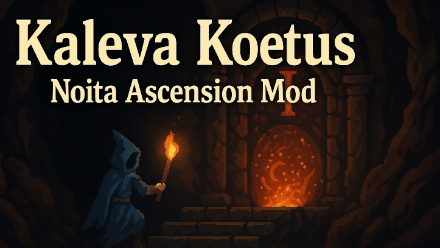

# Kaleva Koetus (Trial of Kaleva)

Noita Ascension Mod

[Japanese](./docs/README.ja.md)

## Overview

Kaleva Koetus is a mod that adds a progressive difficulty system (Ascension) to Noita.

By clearing an Ascension level, the next one will unlock with greater challenges.

Please see the Steam Workshop page for a detailed description:

<https://steamcommunity.com/workshop/filedetails/?id=3581809694>

## Ascension List

You can check the text messages in [common.csv](files/translations/common.csv).  
They can also be viewed in-game from the Ascension icon.

## How to Use

### Installation

1. Place the `kaleva_koetus` folder in Noita’s `mods` directory.  
2. Enable the mod from the in-game Mods menu.

### Settings

- In **Mod Settings** > **Kaleva Koetus**, select an Ascension level.  
- The selectable levels are limited to the highest level you have cleared.  
- A debug option is available to unlock all Ascensions.  
- Clearing (winning) a run unlocks the next level.

## Development Info

### Development Tools

- **Selene**: Lua linter (`selene-noita.yaml` configuration)  
- **stylua**: Code formatter (`stylua.toml` configuration)

## LICENSE

- [Noita MOD Rules](docs/NOITA_MOD_RULES.md)  
- [This Project License](docs/LICENSE.md)

## Contribution

Pull requests and issue reports are welcome.  
If you'd like to contribute, please check [Development flow](docs/development_flow.md)
