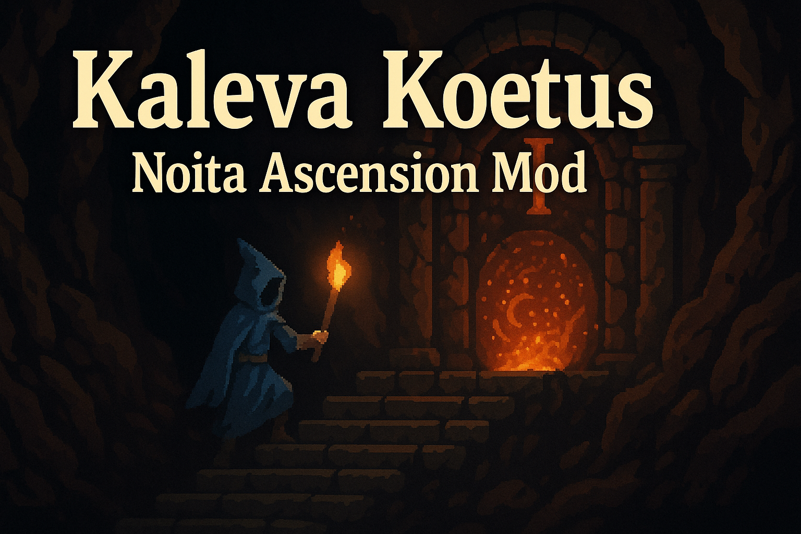

# Kaleva Koetus (Kalevaの試練)

Noita Ascension Mod

## 概要

Kaleva Koetusは、Noitaに段階的な難易度上昇システム（アセンション）を追加するModです。

各アセンションレベルをクリアすることで次のレベルがアンロックされ、より困難な挑戦が待ち受けています。

ゲームの説明はSteam Workshopを確認してください。

<https://steamcommunity.com/workshop/filedetails/?id=3581809694>

## アセンション一覧

[common.csv](files/translations/common.csv)のテキストメッセージから把握してください。ゲーム内のアセンションアイコンからでも確認可能です。

## 使用方法

### インストール

1. `kaleva_koetus` フォルダをNoitaのmodsディレクトリに配置
2. ゲーム内でModを有効化

### 設定

- **Mod Settings** > **Kaleva Koetus** でアセンションレベルを選択
- 選択可能レベルは最高到達レベルまで
- デバッグ機能を使えば全アセンションアンロックはできるようにしています
- クリア（勝利）すると次のレベルがアンロック

## 開発情報

### 開発ツール

- **Selene**: Luaリンター (設定: `selene-noita.yaml`)
- **stylua**: コードフォーマッター (設定: `stylua.toml`)

## LICENSE

- [Noita MOD Rules](docs/NOITA_MOD_RULES.md)
- [This Project License](docs/LICENSE.md)

## 貢献

プルリクエストや Issues の報告を歓迎します。
