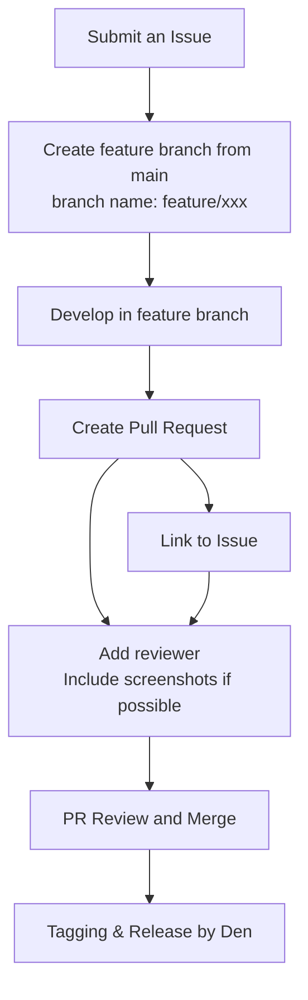

# Release flow

This document describes the standard release process for the project.
This project follows the GitHub Flow development model.

## 1. Submit an Issue

Create an issue for the corresponding ticket.  

> [!NOTE]
> You may create a pull request directly without opening an issue first.However, please note that Den may reject the PR if it was not preceded by an issue.

## 2. Create a Feature Branch

Branch off from the target branch (usually `main`).  
The branch name should follow the format:

```text
feature/xxx
```

Example:

```text
feature/implement-a10
```

## 3. Develop in the Feature Branch

Work on your implementation within the created branch.  
Commit changes with meaningful messages and ensure that all tests or checks pass locally.

commit rule is written in [commit rules](./commit_rules.md)

## 4. Create a Pull Request (PR)

Once development is complete:

- Open a PR from your feature branch.  
- Link the PR to the corresponding **issue**.  
- Assign at least one **reviewer**.  
- If possible, attach **screenshots** or other visuals showing the change.

## 5. Merge the PR

After review and approval, the PR is merged into the main branch.

## 6. Tag and Release

After merging, **Den** will handle:

- **Tagging** the release version  
- **Publishing** the release (e.g., to Workshop or GitHub Releases)

## 🪶 Diagram


